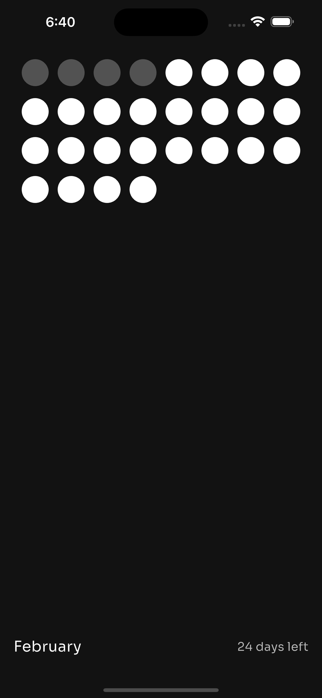

# Left for Android 📱

<p align="center">
  &nbsp;&nbsp;
  
</p>

### Overview 🎯

A simple, no-frills app that visualizes your life as dots—dull for days you've lived, bright for the days ahead. No ads, no sign-ups, just a clean way to track time.

### Download APK
Get the latest version of Left for Android:
[Download APK](https://drive.google.com/file/d/14ZqXWz4u2dkYNldHAGxYHR_RvLHNrupE/view?usp=drive_link)

### Build from Source
Clone and run the project locally:

```bash
git clone https://github.com/itsAbhishekV/Left-iOS.git
cd Left-iOS
flutter pub get
flutter run
