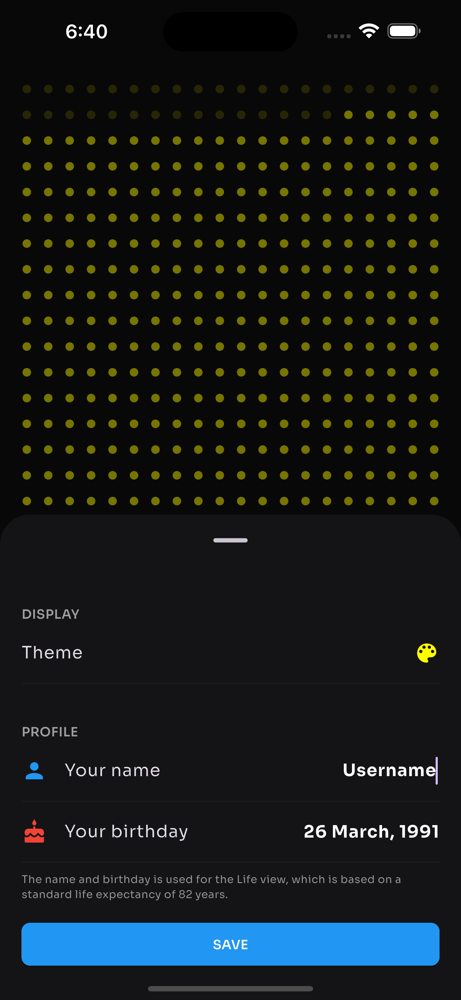

# SupaDots (Left for Android) 📱

<p align="center">
  &nbsp;&nbsp;
  
</p>

### 📥 Download APK

[Get the latest APK](https://drive.google.com/file/d/14ZqXWz4u2dkYNldHAGxYHR_RvLHNrupE/view?usp=drive_link)

### 🚀 Clone & Run

### Build from Source
Clone and run the project locally:

```bash
git clone https://github.com/itsAbhishekV/Left-iOS.git
cd Left-iOS
flutter pub get
flutter run
```
